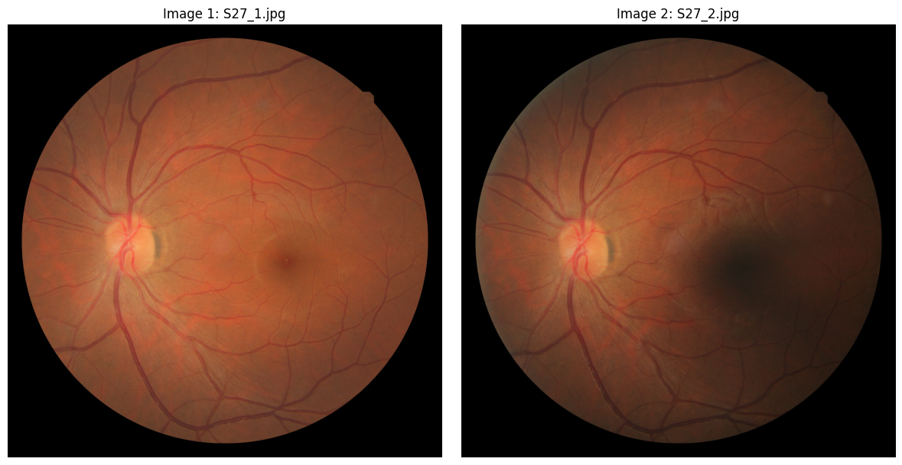
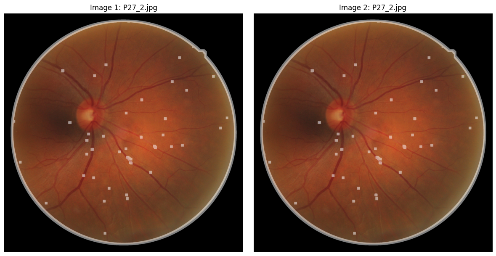
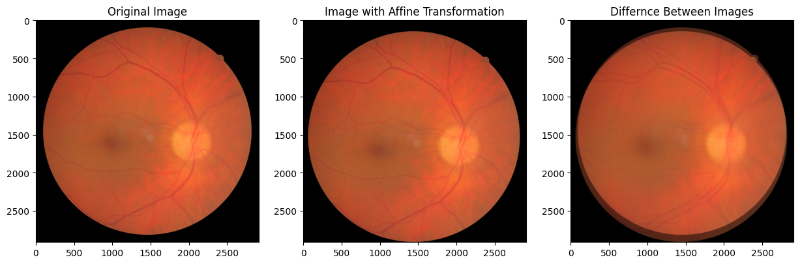

# Medical-Image-Registration
This project demonstrates a medical image registration workflow using homologous points and geometric transformations on retinal fundus images from the FIRE dataset.
The objective is to align retinal images accurately to support image analysis and biomedical applications. The project showcases practical skills in computer vision, image processing, geometric transformations, quanitative evaluation, and Python-based scientific computing.

---

## Project Overview
Medical image registration is a fundamental task in computer vision and medical imaging. The goal is to align multiple images of the same subject so that corresponding anatomical structures overlap accurately.
In this project, retinal images from the FIRE (Fundus Image Registration Dataset) were registered using manually selected homologous points and geometric trasnformations.

---

## Methodology
The registration workflow consists of the following steps:
1. Loading retinal image pairs from the FIRE dataset
2. Selection of homologous (corresponding) points
3. Estimation of affine transformation parameters
4. Image alignment and registration
5. Visualization of transformed images
6. Quantitative evaluation of registration quality

---

## Sample Results
The following examples illustrate the complete image registration workflow, from retinal image pair selection and homologous point matching to affine trasformation and quantitative evaluation.
### Input Retinal Images
Retinal image pair selected from the FIRE dataset and used as input for the registration process.

### Homologous Point Matching
Corresponding anatomical landmarks identified across the retinal image pair and used to estimate the affine trasnformation.

### Affine Registration Result
Comparison between the original image, the transformed image, and the difference image after affine registration.

---

### Quantitative Evaluation Example
|        Metric         | Before Registration | After Registration |
|-----------------------|---------------------|--------------------|
|Correlation Coefficient|         0.933       |       0.925        |
|  Mutual Information   |         0.924       |       1.207        |

The increase in Mutual Information indicates improved alignment between the registered retinal images.
> Note: Results may vary depending onthe selected image pair and homologous points.

---

## Technologies Used
- Python
- Jupyter Notebook
- NumPy
- OpenCV
- Matplotlib
- SciPy
- Scikit-learn

---

## Dataset
The images used in this project were obtained from the FIRE Dataset:
**FIRE - Fundus Image Registration Dataset**
[FIRE Retinal Image Dataset](https://projects.ics.forth.gr/cvrl/fire/)

---

## Author
Marina Kotsiopoulou
